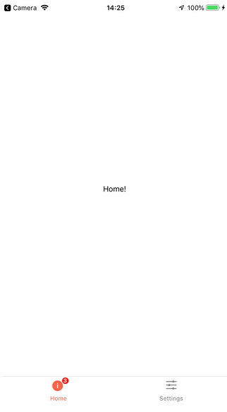
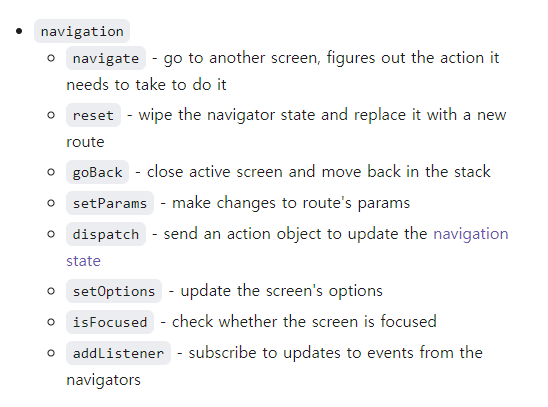

# react-native 네이게이터 적용하기

네비게이터 종류는 크게 세 가지가 존재한다.

1. Stack navigation
2. Tap navigation
3. Drawal navigation

### StackNavigation

> 말 그대로 경로가 스택에 쌓이는 구조인 네비게이션이다.
>
> 웹에서 router경로를 통해 이동할때 스택에 쌓이며, 뒤로가기를 누르면 pop을 해줘 이전의 경로를 반환하는 것과 동일한 방식으로 동작한다.


### Tap navigation

> Tap Navigation은 다시 Top/Bottom Navagation으로 나눌 수 있고, 모바일에서 하단, 상단의 네비게이션 탭으로 볼 수 있다.
>
> 클릭하면, 바로 그 탭으로 이동하는 네비게이션이다.



#### 중요

- 특정한 스크린에서 탭을 숨길 수 있다. A tab navigator contains a stack and you want to hide the tab bar on specific screens[#](https://reactnavigation.org/docs/tab-based-navigation#a-tab-navigator-contains-a-stack-and-you-want-to-hide-the-tab-bar-on-specific-screens)


### Drawal Navigation

> 모바일에서 좌/우로 슬라이드했을때 나오는 네비게이션


### 네비게이션 속성

아래처럼 컴포넌트에 props로 navigation 속성을 내려준 후 console.log로 찍어보면 

```react
const App = () => {
  const Tap = createBottomTabNavigator();

  return (
    <NavigationContainer>
      <Tap.Navigator initialRouteName="Home">
        <Tap.Screen name="Home">{(props) => <HomeScreen {...props} />}</Tap.Screen>
        <Tap.Screen name="Report" component={ReportScreen}></Tap.Screen>
        <Tap.Screen name="QRCode" component={QRCodeScreen}></Tap.Screen>
        <Tap.Screen name="Settings" component={SettingsTapScreen}></Tap.Screen>
      </Tap.Navigator>
    </NavigationContainer>
  );
};
```

아래처럼 사용할 수 있는 속성이 나온다. `goBack`, `navigate` 과 같이 자주 사용하는 속성이 나오는데,

```
{"addListener": [Function addListener], "canGoBack": [Function canGoBack], "dangerouslyGetParent": [Function dangerouslyGetParent], "dangerouslyGetState": [Function anonymous], "dispatch": [Function dispatch], "goBack": [Function anonymous], "isFocused": [Function isFocused], "jumpTo": [Function anonymous], "navigate": [Function anonymous], "removeListener": [Function removeListener], "reset": [Function anonymous], "setOptions": [Function setOptions], "setParams": [Function anonymous]}
```

공식문서를 보니 자세한 내용이 나와있었다.



사용법은 아래와 같다.

```react
<Button title="홈으로" onPress={() => navigation.navigate('Home')} />
<Button title="뒤로가기" onPress={() => navigation.goBack()} />
```