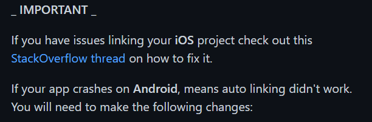
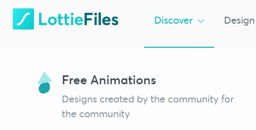

# [react-native] lottie 애니메이션 적용하기

> lottie는 유명 animation 라이브러리로 직접 만든 애니메이션을 적용하는것 이외에 사람들이 무료로 올려놓은 자료를 이용할 수 있다. 
>
> - lottie 라이브러리 적용 방법(https://github.com/lottie-react-native/lottie-react-native)
>
> - lottie 애니메이션 무료 다운로드 (https://lottiefiles.com/featured)
>
> 개발환경
>
> - react-native: 0.64.0

### 설치

- React Native >= 0.60.0

```bash
yarn add lottie-react-native
yarn add lottie-ios@3.1.8 

npm i --save lottie-react-native
npm i --save lottie-ios@3.1.8
```

ios앱도 지원하기 위해서는 ios 폴더에서 명령어 실행

```bash
pod install
```


0.60.0 버전 이상이라면 link를 자동으로 지원하지만, Android에서 link가 동작하지 않는다고함(아래 사진 참고)



- **android/app/src/main/java/<AppName>/MainApplication.java**
  - import 부분에 추가
    - `import com.airbnb.android.react.lottie.LottiePackage;` on the imports section
  - `List<ReactPackage> getPackages()`부분에 추가
    - add `packages.add(new LottiePackage());` in `List<ReactPackage> getPackages()`;


- **android/app/build.gradle**
  - `dependencies`
    - `implementation project(':lottie-react-native')`


- **android/settings.gradle**

  ```
  include ':lottie-react-native'
  project(':lottie-react-native').projectDir = new File(rootProject.projectDir, '../node_modules/lottie-react-native/src/android')
  ```

### 사용

1. 애니메이션 파일 가져오기(.json파일)(https://lottiefiles.com/featured)



2. 파일 저장


3. 사용

```react
import React from 'react';
import LottieView from 'lottie-react-native';

export default class BasicExample extends React.Component {
  render() {
    return <LottieView source={require('../assets/carrot1.json')} autoPlay loop />;
  }
}
```


### 심화

애니메이션을 screen에서 바로 적용하려고 시도해보니까 오류가 발생...

이런저런 시도 끝에 애니메이션을 컴포넌트화하여 적용해야한다는 사실을 깨닫고, `components`폴더에 `animations `폴더를 생성하여 사용할 애니메이션을 컴포넌트화 했다.(이러니까 오히려 관리하기 더 좋아지는 듯 싶다.) 


- Carrot.js(예시)

```react
import React from 'react';
import LottieView from 'lottie-react-native';

const Carrot = () => {
  return <LottieView source={require('@/assets/animations/carrot2.json')} autoPlay loop />;
};

export default Carrot;
```

index.js 는 각 컴포넌트에서 한번에 여러 애니메이션을 사용하도록 모아서 뿌려주기 위한 파일

```react
export { default as ArrowToBottom } from './ArrowToBottom';
export { default as Carrot } from './Carrot';
export { default as SpinningCarrot } from './SpinningCarrot';
```

이제 HomeScreen에서 부를 때, 아래와 같이 한 번에 부를 수 있음

```react
import { Carrot, SpinningCarrot, ArrowToBottom } from '@/components/animations';
```

이제 사용해보자.

- HomeScreen.js

```react
import React, { useState } from 'react';
import { View, Text, Button } from 'react-native';

// 1. 불러오고
import { Carrot, SpinningCarrot, ArrowToBottom } from '@/components/animations';

function HomeScreen({ navigation }) {
  ...
  
  return (
    <View style={{ flex: 1, alignItems: 'center', justifyContent: 'center' }}>
      <Text>Home Screen</Text>
      {/* 2. 사용하고 */} 
      <Carrot />
      <SpinningCarrot />
      <ArrowToBottom style={{ width: 50, height: 50, position: 'absolute', bottom: 0 }} />
  
      ...
    </View>
  );
}
export default HomeScreen;

```

### 결과


### 컴포넌트에 props로 style주기

애니메이션을 컴포넌트처럼 사용하고나니 아쉬운점이 발생했다. 각 애니메이션마다 각기 다른 style을 주려면 어떻게 해야하지....?

고민끝에 props로 css 속성을 넘겨주기로 했다.


아래 화살표를 보면 너무 크다. 위치도 정중앙이라 아래로 내려주고싶다.


1. 먼저 `ArrowToBottom.js`컴포넌트로 style을 넘겨준다.

- HomeScreen.js

```react
import React, { useState } from 'react';
import { View, Text, Button } from 'react-native';

import { ArrowToBottom } from '@/components/animations';

function HomeScreen({ navigation }) {
  return (
    <View style={{ flex: 1, alignItems: 'center', justifyContent: 'center' }}>
      ...
      <ArrowToBottom style={{ width: 50, height: 50, position: 'absolute', bottom: 0 }} />
    </View>
  );
}
export default HomeScreen;

```

2. props로 받은 데이터를 style로 그대로 적용해준다.

- ArrowToBottom.js

```react
import React from 'react';
import LottieView from 'lottie-react-native';

function ArrowToBottom({ style }) {
  console.log(style);
  return (
    <LottieView
      style={style} // 적용하기
      source={require('@/assets/animations/arrow-bottom.json')}
      autoPlay
      loop
    />
  );
}
export default ArrowToBottom;
```

3. 감상한다.


